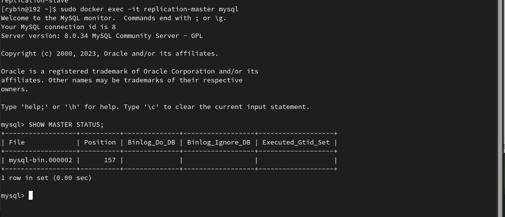
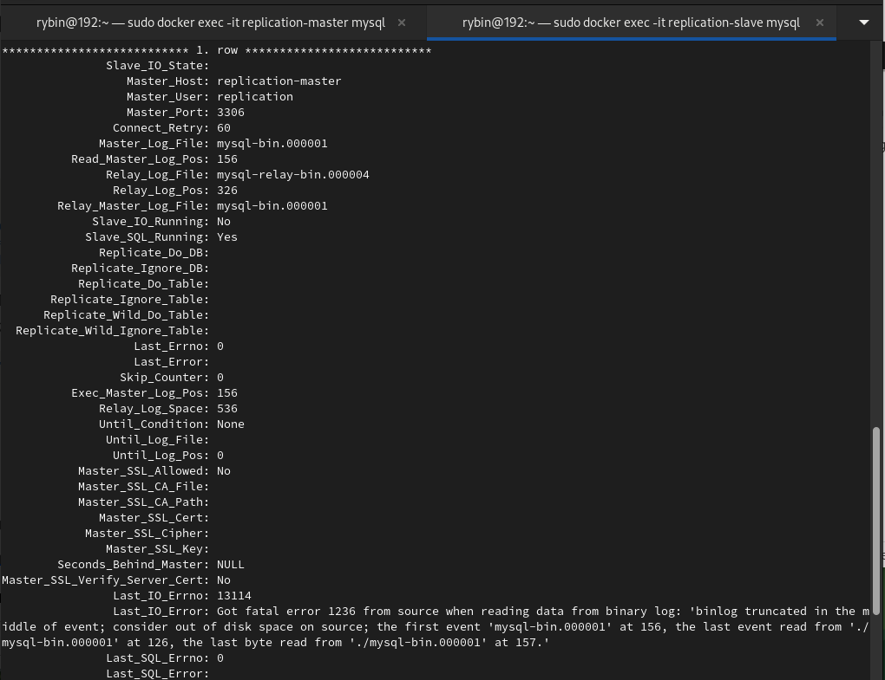

# 12_06_replication_01

Задание 1  
  
На лекции рассматривались режимы репликации master-slave, master-master, опишите их различия.  

Режимы репликации в MySQL, такие как master-slave и master-master, предоставляют возможность создания резервных копий данных, повышения отказоустойчивости и распределения нагрузки между базами данных. Основные различия:  

Режим репликации master-slave  

В режиме master-slave имеется один главный сервер (мастер) и один или несколько вспомогательных серверов (слейвы).  
Мастер-сервер является источником данных, которые реплицируются на слейв-серверы.  
Слейв-серверы могут использоваться для чтения данных и обеспечения отказоустойчивости.  
Мастер-сервер обрабатывает запись данных, а слейв-серверы реплицируют эти данные из мастера.  
Слейв-серверы работают в режиме только для чтения и не принимают записи.  
Режим master-slave обеспечивает резервное копирование данных, но не позволяет обновлять данные на слейв-серверах.  
Режим репликации master-master:  
  
В режиме master-master имеется несколько мастер-серверов, каждый из которых может обрабатывать записи и чтение данных.  
Каждый мастер-сервер может принимать и обновлять данные независимо от других мастер-серверов.    
Репликация данных происходит в обоих направлениях между мастер-серверами  
Режим master-master позволяет балансировать нагрузку и обеспечивает отказоустойчивость  
Однако необходимо обращать особое внимание на разрешение конфликтов при записи данных на разных мастер-серверах.  
Режимы репликации master-slave и master-master имеют свои особенности и применяются в различных сценариях. Master-slave обычно используется для резервного копирования данных и обеспечения отказоустойчивости, в то время как master-master может быть полезен для балансировки нагрузки и обеспечения высокой доступности данных.  
      
Ответить в свободной форме.    
Задание 2   
  
Выполните конфигурацию master-slave репликации, примером можно пользоваться из лекции.  
  
Приложите скриншоты конфигурации, выполнения работы: состояния и режимы работы серверов.  
  
  
  
  
